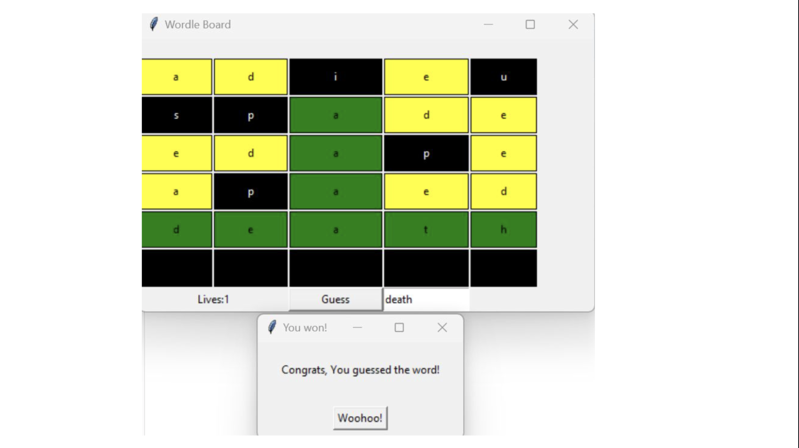
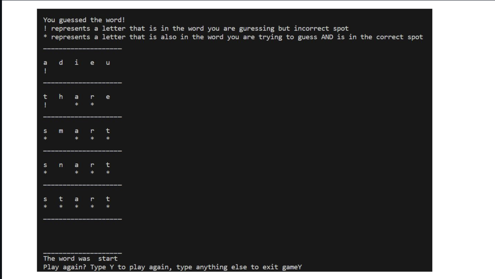
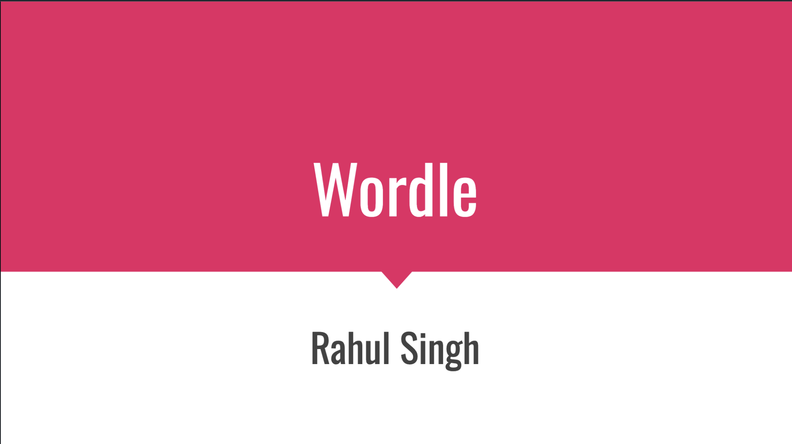
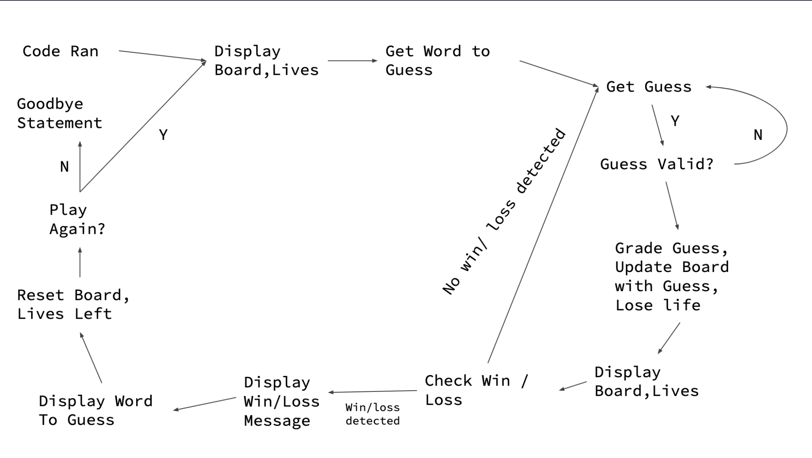

# 📝 Wordle Clone 
This is the Final Project I did for EECE 2140 at Northeastern with Professor Roi Yehoshua. It is a terminal and GUI tkinter interface of the popular game Wordle. 
The program utilized the Model View Controller method to oranize itself and its classes. This allows for easy future appendation and debugging. Run the MainConsole or MainGUI file to utilize the flexibility of the view and play in either your terminal or in a tkinter Graphical User Interface! 

## Supports Both GUI views...

  

## And Terminal views!

  

# Learn More Via this Slideshow... (Click it!)

  <table>
    <tr>
      <td>
        
      </td>
      <td>
        
      </td>
    </tr>
  </table>

